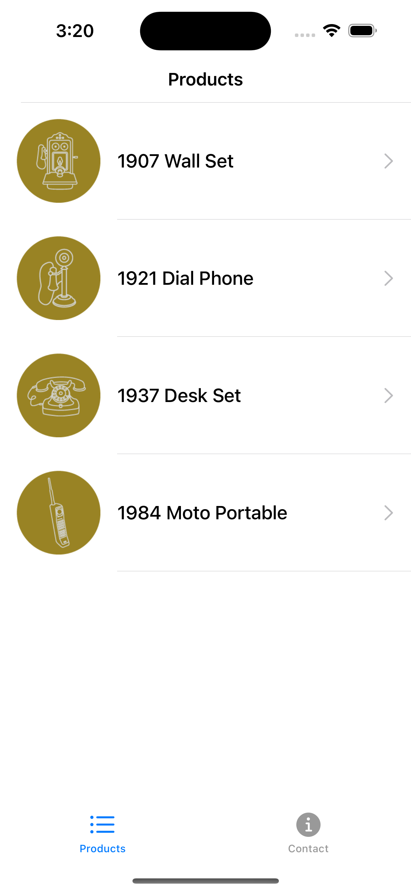
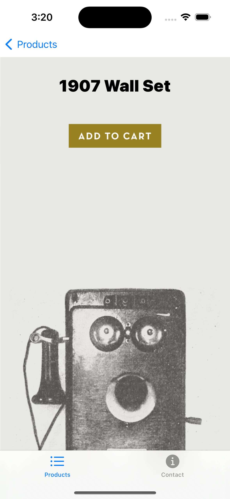
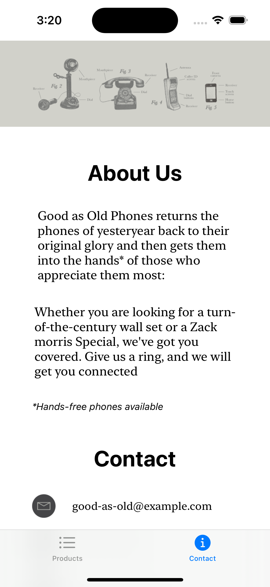
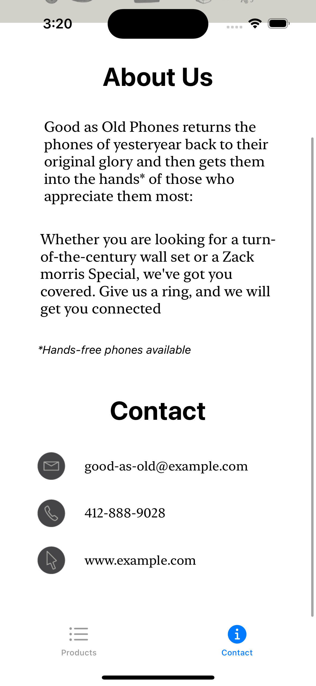

# Swift 30 Projects with SwiftUI

### Preview

Products|ProductDetail|Contact(1)|Contact(2)
:-:|:-:|:-:|:-:
|||

### Issue

- `List` 사용
    - `List` 안에 `NavigationLink`를 넣으면 오른쪽에 화살표가 생기는데 필요가 없어서 가려야 한다
        - `ZStack`을 이용하여 가림 (`EmptyView`, `opacity(0)`)
    - `List`의 기본 inset 값을 없애야한다
        - `.listRowInsets`를 이용하여 `EdgeInsets`의 모든 값을 0으로 설정
